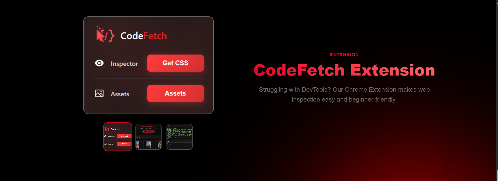
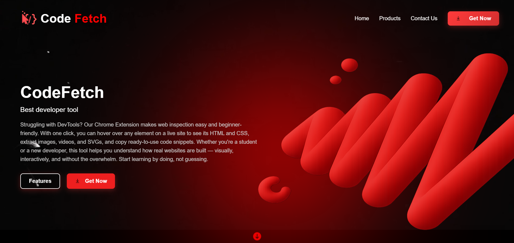
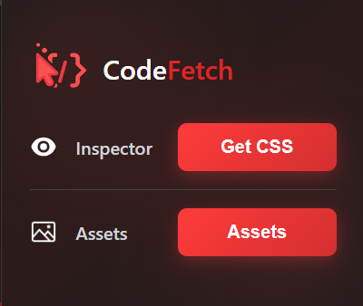
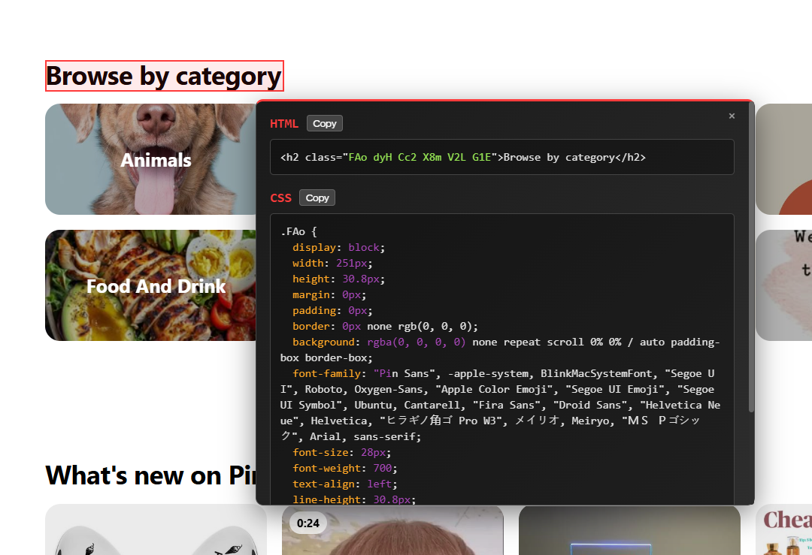
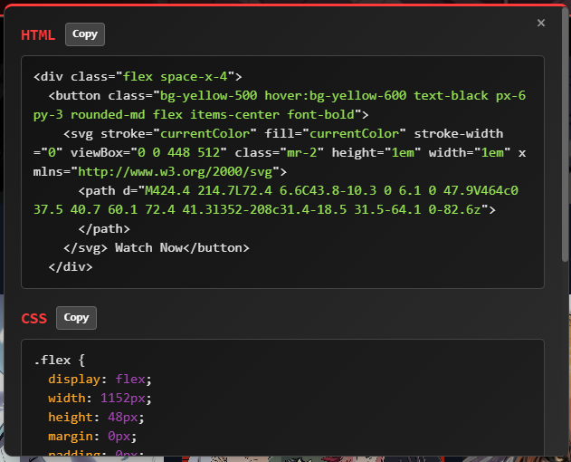
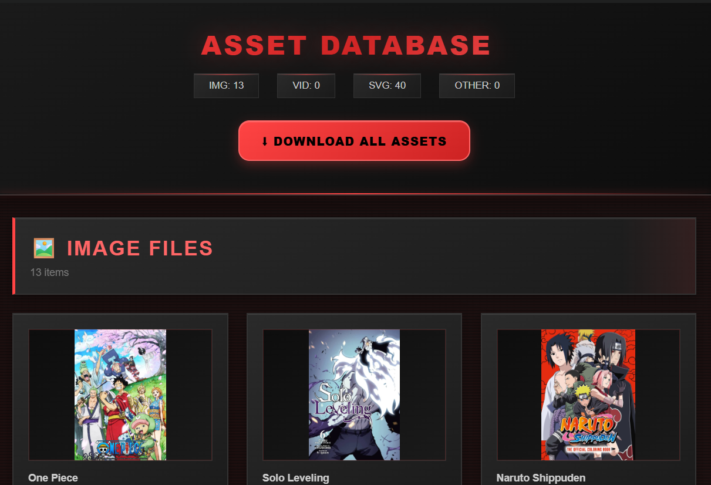
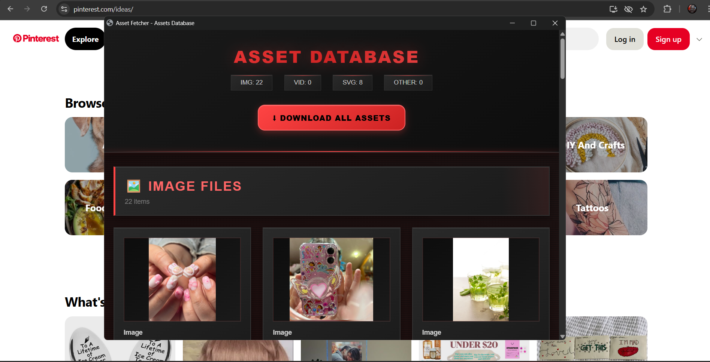

# CodeFetch
# 🚀 CodeFetch - Asset Extractor Chrome Extension

A powerful and simple Chrome extension that allows you to **hover over any element on a live website** and instantly **view its HTML & CSS**, extract **images**, **videos**, **SVGs**, and even **copy ready-to-use code snippets** — all with one click.

---

# 📸 Screenshots

| Hover to Inspect | Assets Window |
|------------------|----------------|
|  |   |

---

# 🎥 Demo Video

[    [👈Watch Demo]](https://youtu.be/8flfpEaSYYM?si=TA6HdOVc1BGHOhoB)

---

# 🔧 Features

- 🔍 **Inspect HTML/CSS** just by hovering on elements
- 🖼️ **Extract Images, Videos, SVGs** from the page
- 🧩 View all assets in a popup window
- 📋 **Copy HTML/CSS snippets** in one click
- 💡 Works on any website, in real-time
- 🧠 Clean UI with fast interaction

---

# 🧑‍💻 How It Works

## Get Css and HTML
1. **Install the Extension**
2. Click the **CodeFetch** icon on any site
3. Click on **Get CSS** button.
4. Hover over elements to get its's html and css
5. Copy the code and use it in your project

## Get assets
1. **Install the Extension**
2. Click the **CodeFetch** icon on any site
3. Click on get **Assets** button.
5. Click on download button appears on hover to download.
6. Click on **Download all Asset** button to download all in one click 

---

# 🛠 Website Live Link

[**🔗CodeFetch**](codefetch.netlify.app)

> _**Note:** The extension is not live yet only the website is live currently._
